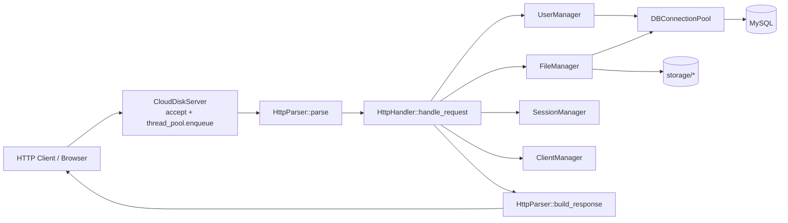

# cloudisk_server 项目技术文档

## 3.1 项目概述
- 项目名称：`lightweight_comm_server`（代码中 `project(lightweight_comm_server)`，业务上为 cloudisk_server）
- 一句话描述：基于 C++17 + MySQL 的轻量网盘与消息服务，支持用户注册登录、文件上传下载（含分块上传）、分享和站内消息。

### 运行环境
- 操作系统：Linux/WSL2 优先（代码含 `_WIN32` 分支，但主流程以 Linux 为主）
- 编译器：`g++`（C++17）
- 构建工具：`cmake`、`make`
- 核心依赖：
- MySQL C API（`mysql/mysql.h`、`mysqlclient`）
- OpenSSL（SHA256，`OpenSSL::Crypto`/`OpenSSL::SSL`）
- POSIX 线程（`Threads::Threads`）
- `uuid`（Linux 侧 UUID）
- `stdc++fs`

### 部署方式
- 编译：
```bash
cmake -S . -B build
cmake --build build -j
```
- 数据库初始化：执行 `init.sql`。
- 启动：
```bash
./build/lightweight_comm_server
```
- 可选环境变量：`SERVER_PORT`、`STORAGE_PATH`、`STATIC_DIR`、`DB_HOST`、`DB_PORT`、`DB_USER`、`DB_PASSWORD`、`DB_NAME`。

## 3.2 系统架构


### 分层职责
- 网络层：`CloudDiskServer`（`src/server.cpp`）负责监听、`accept`、读写 socket、提交线程池任务。
- 业务层：`HttpHandler` 分发路由；`UserManager`、`FileManager`、`SessionManager`、`ClientManager` 执行业务。
- 数据层：`Database` + `DBConnectionPool` 封装 MySQL 访问；文件二进制落盘到 `storage/`。

### 请求生命周期
1. `CloudDiskServer::run()` 接受连接并 `thread_pool->enqueue(handle_client)`。
2. `handle_client()` 循环 `read`，按 `\r\n\r\n` + `Content-Length` 拼接完整请求。
3. `HttpParser::parse()` 解析请求行/Query/Header/Body。
4. `HttpHandler::handle_request()` 根据 `path + method` 进入具体 handler。
5. handler 调用各 Manager，必要时访问 MySQL 或文件系统。
6. 普通响应走 `HttpParser::build_response()`；流式下载走 `write_all + ifstream` 分块写回。
7. 连接关闭，`client_manager->remove_client()`。

## 3.3 核心模块详解

### 1) 网络 I/O 模块
- 文件/类：`include/server.h`、`src/server.cpp`、`CloudDiskServer`
- 职责：监听端口、接收连接、请求读取、响应发送、连接生命周期管理。
- 关键结构：`server_fd`、`running`、`ThreadPool`、`ClientManager`。
- 核心函数：
- `create_socket()`：`socket/bind/listen` 初始化。
- `run()`：`accept` 后投递线程池。
- `handle_client(int client_fd)`：收包、解析、分发、回包、关闭。
- 依赖：`HttpParser`、`HttpHandler`、`ThreadPool`、`ClientManager`。
- 说明：当前实现**未使用 epoll**，是阻塞 `accept/read/write` + 线程池模型。

### 2) 线程池
- 文件/类：`include/thread_pool.h`、`src/thread_pool.cpp`、`ThreadPool`
- 职责：异步执行客户端任务。
- 关键结构：`workers`、`tasks`、`queue_mutex`、`condition`、`stop`、`max_queue_size`。
- 核心函数：
- `enqueue(F&&)`：队列满抛异常；`condition.notify_one()`。
- 构造函数：工作线程循环 `wait -> pop -> task()`。
- 析构函数：置 `stop=true`，`notify_all`，`join`。
- 依赖：`CloudDiskServer` 提交任务。

### 3) HTTP 解析器
- 文件/类：`include/http_parser.h`、`src/http_parser.cpp`、`HttpParser`
- 职责：把原始 HTTP 文本转 `HttpRequest`，把 `HttpResponse` 序列化。
- 关键结构：`HttpRequest`、`HttpResponse`（在 `http_handler.h` 定义）。
- 核心函数：
- `HttpParser::parse()`：解析请求行、query 参数（含 URL decode）、header、body。
- `HttpParser::build_response()`：拼状态行与 headers，自动补 `Content-Length`、`Connection: close`。

### 4) 路由分发
- 文件/类：`src/http_handler.cpp`、`HttpHandler::handle_request`
- 职责：`if` 链按 `path + method` 分发。
- 特点：无通用路由表/中间件，直接硬编码判断。
- 依赖：`UserManager`、`FileManager`、`SessionManager`、`ClientManager`。

### 5) MySQL 连接池
- 文件/类：`include/database.h`、`src/database.cpp`、`DBConnectionPool`
- 职责：复用数据库连接，控制并发访问。
- 关键结构：`connections`、`available`、`pool_mutex`、`cv`。
- 核心函数：
- `get_connection()`：条件变量等待可用连接；返回带自定义 deleter 的 `shared_ptr`。
- `return_connection()`：标记可用并 `notify_one`。
- 依赖：`UserManager`、`FileManager`。

### 6) 用户管理模块
- 文件/类：`include/user_manager.h`、`src/user_manager.cpp`、`UserManager`
- 职责：注册、登录、资料更新、空间统计、消息读写。
- 关键结构：`User`、`Message`。
- 核心函数：
- `register_user()`：查重后插入用户。
- `login()`：取 `password_hash` 比对。
- `hash_password()`：OpenSSL `SHA256_*`。
- `send_message/get_messages/mark_messages_read()`：消息系统基础能力。

### 7) 文件管理模块
- 文件/类：`include/file_manager.h`、`src/file_manager.cpp`、`FileManager`
- 职责：普通上传下载、分块上传、重命名、删除、搜索、分享码。
- 关键结构：`FileInfo`、`UploadSession`、`UploadProgress`。
- 核心函数：
- 普通上传：`upload_file()`（写磁盘 + 写 `files` + 更新 `users.storage_used`）。
- 分块上传：`create_upload_session()`、`save_chunk()`、`get_upload_progress()`、`complete_upload()`、`cancel_upload()`。
- 下载：`download_file()`、`handle_file_download_stream` 配合流式发送。
- 分享：`create_share_code()`、`get_shared_file_info()`。
- 分块流程：初始化会话 -> 上传 chunk（SHA256 校验）-> 查询进度 -> 合并 chunk -> 事务写库并清理临时目录。

### 8) 消息模块
- 文件/类：`UserManager` + `HttpHandler` 中消息路由
- 已实现：
- `POST /api/message/send`
- `GET /api/message/list`
- 逻辑：写 `messages` 表、按会话双方倒序拉取、拉取后标记已读。

### 9) 分享模块
- 文件/类：`FileManager::create_share_code/get_shared_file_info`、`HttpHandler::handle_share_*`
- 已实现：基于 `files.share_code` 的分享码创建与下载。
- 未使用：`share_codes` 表当前仅在 `init.sql` 预留，代码未实际读写该表。

## 3.4 数据库设计

### 数据表总览

#### users
- `id INT PK AI`：用户主键
- `username VARCHAR(50) UNIQUE`：用户名
- `password_hash VARCHAR(255)`：密码哈希
- `email VARCHAR(100) UNIQUE`：邮箱
- `storage_used BIGINT`：已用空间
- `storage_limit BIGINT`：空间上限
- `created_at/updated_at TIMESTAMP`

#### files
- `id INT PK AI`
- `user_id INT FK -> users(id)`
- `filename VARCHAR(255)`：服务器唯一文件名
- `original_filename VARCHAR(255)`：原始名
- `file_path VARCHAR(512)`：落盘绝对/相对路径
- `file_size BIGINT`
- `mime_type VARCHAR(100)`
- `share_code VARCHAR(64) UNIQUE`
- `upload_date TIMESTAMP`

#### upload_sessions
- `id BIGINT PK AI`
- `user_id INT FK -> users(id)`
- `upload_id VARCHAR(64) UNIQUE`
- `total_chunks INT`
- `file_size BIGINT`
- `original_filename VARCHAR(255)`
- `mime_type VARCHAR(100)`
- `status VARCHAR(32)`：`uploading/completed/cancelled`
- `expires_at/created_at/updated_at`

#### upload_chunks
- `id BIGINT PK AI`
- `upload_id VARCHAR(64) FK -> upload_sessions(upload_id)`
- `chunk_index INT`
- `chunk_hash VARCHAR(64)`
- `chunk_size BIGINT`
- `status VARCHAR(32)`
- `uploaded_at TIMESTAMP`
- `UNIQUE(upload_id, chunk_index)`

#### sessions
- `id VARCHAR(100) PK`
- `user_id INT FK -> users(id)`
- `token VARCHAR(255)`
- `created_at/expires_at`
- 说明：当前服务端主要使用内存 `SessionManager`，该表未参与主流程。

#### messages
- `id INT PK AI`
- `sender_id INT FK -> users(id)`
- `receiver_id INT FK -> users(id)`
- `content TEXT`
- `is_read TINYINT(1)`
- `created_at TIMESTAMP`

#### share_codes
- `id BIGINT PK AI`
- `file_id INT FK -> files(id)`
- `code VARCHAR(64) UNIQUE`
- `created_by INT FK -> users(id)`
- `created_at/expires_at`
- 说明：当前代码未实际使用。

### 表关系（ASCII）
```text
users 1----N files
users 1----N upload_sessions 1----N upload_chunks
users 1----N messages (sender_id)
users 1----N messages (receiver_id)
files 1----0..1 share_code(字段)
files 1----N share_codes(预留表)
```

### 关键查询示例（来自代码）
```sql
-- 登录查询
SELECT id, username, email, password_hash, storage_used, storage_limit, created_at
FROM users WHERE username = ?;

-- 文件列表
SELECT id, user_id, filename, original_filename, file_path, file_size, mime_type, upload_date
FROM files WHERE user_id = ? ORDER BY upload_date DESC LIMIT ? OFFSET ?;

-- 拉取会话消息
SELECT id, sender_id, receiver_id, content, is_read, created_at
FROM messages
WHERE (sender_id = ? AND receiver_id = ?)
   OR (sender_id = ? AND receiver_id = ?)
ORDER BY created_at DESC, id DESC LIMIT ?;
```

## 3.5 网络协议

### 监听地址与端口
- 地址：`0.0.0.0`（`INADDR_ANY`）
- 端口：默认 `9090`（可由 `SERVER_PORT` 覆盖）

### HTTP 方法与路由
| 方法 | 路由 | 说明 |
|---|---|---|
| POST | `/api/register` | 注册 |
| POST | `/api/login` | 登录 |
| POST | `/api/logout` | 退出 |
| GET | `/api/user/info` | 用户信息 |
| PUT/POST | `/api/user/profile` | 修改资料 |
| GET | `/api/file/list` | 文件列表 |
| POST | `/api/file/upload/init` | 初始化分块上传 |
| POST | `/api/file/upload/chunk` | 上传分块 |
| GET | `/api/file/upload/progress` | 查询上传进度 |
| POST | `/api/file/upload/complete` | 完成分块上传 |
| POST | `/api/file/upload/cancel` | 取消分块上传 |
| POST | `/api/file/upload` | 普通上传 |
| GET | `/api/file/download/stream` | 流式下载 |
| GET | `/api/file/download?id=...` 或 `/api/file/download/{id}` | 下载文件 |
| POST/DELETE | `/api/file/delete` | 删除文件 |
| POST/PUT | `/api/file/rename` | 重命名 |
| GET | `/api/file/search` | 搜索 |
| POST | `/api/share/create` | 创建分享码 |
| GET | `/api/share/download?code=...` | 分享下载 |
| GET | `/api/server/status` | 在线状态 |
| POST | `/api/message/send` | 发送消息 |
| GET | `/api/message/list` | 拉取消息 |
| GET | `/`、`/index.html`、`/static/*` | 静态资源 |

### 请求/响应格式
- 主体格式：多数 API 使用 `application/json`。
- 通用响应包装：
```json
{"code":200,"message":"...","data":{...}}
```
- 文件上传：
- 普通上传：body 为二进制，文件名走 Header `X-Filename`（URL decode）。
- 分块上传：chunk 二进制在 body，`upload_id/chunk_index/chunk_hash` 在 query 参数。
- 下载响应：`Content-Disposition` 包含 `filename` 与 `filename*`（UTF-8 URL 编码）。

### Session 机制
- token 来源：
- Header `Authorization: Bearer <token>`
- 或 `X-Token: <token>`
- 生成方式：`SessionManager::generate_token()` 生成 32 hex 字符串。
- 存储位置：进程内 `std::map<std::string, Session> sessions`。
- 校验流程：`get_user_id_from_session()` -> `session_manager->get_user_id(token)`（过期即删除并返回 -1）。
- Cookie：代码中**未实现 cookie 读写字段**，采用 Header Token。

## 3.6 关键技术原理

### epoll ET/LT 模式选择及原因
- 实际情况：当前代码未使用 epoll（无 `epoll_create/epoll_ctl/epoll_wait`），因此 ET/LT 未涉及。
- 当前选择：阻塞 socket + 线程池，简单直接，但高并发下线程/上下文切换成本更高。

### 线程池调度与线程安全
- 调度：生产者 `enqueue` 入队并 `notify_one`；消费者线程 `condition.wait` 等待任务。
- 线程安全：`queue_mutex` 保护 `tasks`；`condition_variable` 避免忙等；析构阶段 `stop + notify_all + join` 保证退出完整。

### MySQL 连接池并发安全
- `pool_mutex` + `cv` 保护连接可用位图 `available`。
- 无可用连接时阻塞等待；归还连接后 `notify_one`。
- `Database` 内部也有 `db_mutex`，防止单连接对象并发调用冲突。

### 文件分块上传状态管理
- 临时目录：`storage/uploads/{upload_id}/chunk_{index}`。
- 状态表：`upload_sessions` 记录会话状态和过期时间，`upload_chunks` 记录块状态与哈希。
- 合并逻辑：`merge_chunks()` 按索引顺序合并到最终文件；`complete_upload()` 事务更新 `files/users/upload_sessions`，成功后删除临时目录。

### SHA256 密码哈希
- 位置：`UserManager::hash_password()`（`src/user_manager.cpp`）。
- 调用：注册时 `register_user()` 存哈希；登录时 `verify_password()` 比对。
- 备注：当前为无盐 SHA256。

## 3.7 功能列表
| 功能 | HTTP 方法 | 路由路径 | 说明 |
|---|---|---|---|
| 用户注册 | POST | `/api/register` | 用户名/邮箱/密码注册 |
| 用户登录 | POST | `/api/login` | 返回 token、用户名、id |
| 用户登出 | POST | `/api/logout` | 删除会话 |
| 查询用户信息 | GET | `/api/user/info` | 返回配额和基本信息 |
| 更新资料 | PUT/POST | `/api/user/profile` | 更新用户名和邮箱 |
| 文件列表 | GET | `/api/file/list` | 支持 offset/limit |
| 普通上传 | POST | `/api/file/upload` | body 二进制上传 |
| 分块上传初始化 | POST | `/api/file/upload/init` | 创建 upload_id |
| 分块上传 | POST | `/api/file/upload/chunk` | 校验 SHA256 后落盘 |
| 上传进度查询 | GET | `/api/file/upload/progress` | 返回 completed/total/progress |
| 分块上传完成 | POST | `/api/file/upload/complete` | 合并分块并入库 |
| 分块上传取消 | POST | `/api/file/upload/cancel` | 标记取消并清理临时文件 |
| 文件下载 | GET | `/api/file/download` | 支持 id 参数或路径 id |
| 流式下载 | GET | `/api/file/download/stream` | 大文件分块响应 |
| 文件删除 | POST/DELETE | `/api/file/delete` | 删除文件并回收配额 |
| 文件重命名 | POST/PUT | `/api/file/rename` | 改 `original_filename` |
| 文件搜索 | GET | `/api/file/search` | 按文件名模糊查询 |
| 创建分享码 | POST | `/api/share/create` | 写入 `files.share_code` |
| 分享下载 | GET | `/api/share/download` | 免登录按分享码下载 |
| 消息发送 | POST | `/api/message/send` | 用户互发消息 |
| 消息拉取 | GET | `/api/message/list` | 拉取并标记已读 |
| 服务状态 | GET | `/api/server/status` | 活跃连接与客户端信息 |
| 静态资源服务 | GET | `/`、`/static/*` | 返回前端页面与脚本 |

## 3.8 不足与改进方向

### 安全性
- 密码哈希为无盐 SHA256，抗撞库能力有限。
- Session token 为随机 hex 串但仅内存存储，未绑定设备/IP，且未启用 HTTPS/TLS 强制。
- API 认证依赖自定义 Header，缺少标准化刷新机制与签名方案。
- 改进：改用 `bcrypt/argon2`，引入 `JWT + refresh token` 或持久会话，启用 HTTPS，增加登录限流与审计。

### 可靠性
- 网络层每连接单次请求后即关闭，缺少 keep-alive 与半包/异常复杂场景的精细处理。
- 部分 SQL 采用字符串拼接，虽有 `escape_string` 但不如预处理语句稳健。
- `init.sql` 中部分“兼容旧字段”语句在当前建表中并不存在，运维可读性一般。
- 改进：统一 prepared statement、完善错误码映射、增加重试/熔断与更细日志级别。

### 性能
- 未使用 epoll/IO 多路复用，阻塞 I/O + 大线程池在高并发下扩展性一般。
- 普通下载会整文件读入内存（`download_file`），大文件内存压力高；虽有 `/stream`，但客户端需主动选择。
- 改进：引入 epoll + 非阻塞 socket、连接复用、默认流式下载、零拷贝（`sendfile`）优化。

### 功能完整性
- 分块上传支持初始化/续块/进度/完成/取消，但不具备完整断点续传协议协商（如客户端秒传/去重、断线自动恢复策略）。
- 仅有 SHA256 chunk 校验，缺少整文件哈希对账与可选 MD5/Etag。
- `share_codes` 表未纳入实际逻辑，分享有效期/权限粒度不完整。
- 改进：补全断点续传元数据协商、文件级哈希校验、分享有效期与访问次数限制、鉴权范围控制。

---

## 附：关键函数签名摘录
```cpp
bool CloudDiskServer::start();
void CloudDiskServer::run();
void CloudDiskServer::handle_client(int client_fd);

HttpRequest HttpParser::parse(const std::string &raw_request);
std::string HttpParser::build_response(const HttpResponse &response);

HttpResponse HttpHandler::handle_request(const HttpRequest &request);

std::shared_ptr<Database> DBConnectionPool::get_connection();
void DBConnectionPool::return_connection(std::shared_ptr<Database> conn);

std::optional<UploadSession> FileManager::create_upload_session(...);
bool FileManager::save_chunk(...);
UploadProgress FileManager::get_upload_progress(const std::string &, int);
std::optional<FileInfo> FileManager::complete_upload(const std::string &, int);

bool UserManager::register_user(const std::string &, const std::string &, const std::string &);
std::optional<User> UserManager::login(const std::string &, const std::string &);
```
