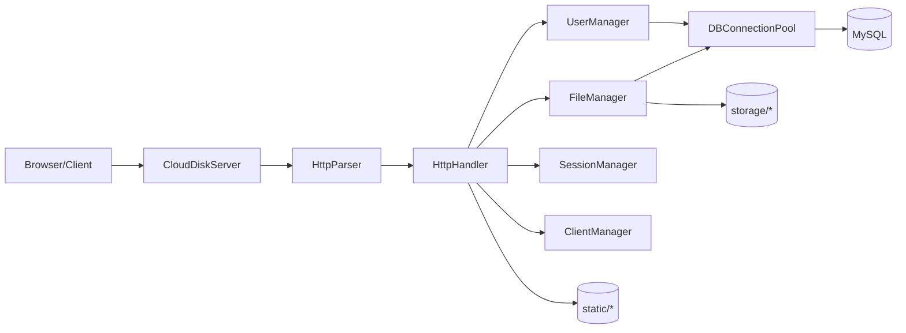

# cloudisk_server 项目技术文档（更新版）

> 更新时间：2026-05-09  
> 基于当前仓库代码重新整理，覆盖后端、前端、数据库、测试与部署。

## 3.1 项目概述
- 项目名称：`lightweight_comm_server`（业务上为 cloudisk_server）
- 一句话描述：基于 C++17 + MySQL 的轻量云盘与站内消息系统，支持用户注册登录、文件管理、分块上传、分享下载与在线状态查看。

### 运行环境
- 操作系统：Linux/WSL2（代码含 `_WIN32` 分支）
- 编译器：`g++`（C++17）
- 构建工具：`cmake`、`make`
- 依赖：
- MySQL C API（`mysqlclient`）
- OpenSSL（SHA256）
- POSIX Threads
- `uuid`
- `stdc++fs`

### 启动方式
```bash
cmake -S . -B build
cmake --build build -j
./build/lightweight_comm_server
```

### 可配置环境变量
- `SERVER_PORT`（默认 `9090`）
- `STORAGE_PATH`（默认 `./storage`）
- `STATIC_DIR`（默认 `static`）
- `DB_HOST`、`DB_PORT`、`DB_USER`、`DB_PASSWORD`、`DB_NAME`

## 3.2 系统架构


### 分层职责
- 网络层：`src/server.cpp`，阻塞 socket + 线程池处理连接。
- 协议层：`src/http_parser.cpp` 解析请求、构建响应。
- 业务层：`src/http_handler.cpp` 路由分发；`user/file/session/client` 管理器执行业务。
- 数据层：`src/database.cpp` + 连接池访问 MySQL。
- 前端层：`static/` 下原生 JS 组件化页面。

## 3.3 核心模块详解

### 1) 网络与并发
- `CloudDiskServer::run()`：`accept` 后投递到 `ThreadPool`。
- `handle_client()`：拼接完整 HTTP 请求（头 + `Content-Length` body），解析并分发。
- 并发模型：阻塞 I/O + 线程池（未使用 epoll）。

### 2) 路由与业务编排
- 文件：`src/http_handler.cpp`
- 方式：`if` 链按 `path + method` 分发。
- 已覆盖用户、文件、分享、消息、状态、静态资源。

### 3) 用户与会话
- `UserManager`：注册、登录、资料更新、消息读写。
- `SessionManager`：内存 token 管理（Header 鉴权）。

### 4) 文件与分块上传
- `FileManager`：普通上传、下载、删除、重命名、搜索、分享码。
- 分块上传：`init -> chunk -> progress -> complete/cancel`。
- 上传块存储：`storage/uploads/{upload_id}/chunk_{index}`。

### 5) 前端模块（新增整理）
- 入口：`static/app.js`
- 组件：`static/components/*`（Sidebar、Header、FileList、MessagePanel、ContextMenu 等）
- 工具：`static/utils.js`
- 独立上传器：`static/large_file_uploader.js`（分块 SHA-256 校验后上传）

## 3.4 数据库设计（`init.sql`）

### 核心表
- `users`
- `files`
- `upload_sessions`
- `upload_chunks`
- `sessions`
- `messages`
- `share_codes`

### 索引与兼容脚本
- `init.sql` 中含 `ALTER TABLE ... IF NOT EXISTS` 风格兼容逻辑（通过 `information_schema` + 动态 SQL）。
- 包含上传会话、消息、会话等关键索引创建逻辑。

## 3.5 网络协议与接口

### 监听
- 地址：`0.0.0.0`
- 端口：默认 `9090`，可由 `SERVER_PORT` 覆盖。

### 主要 API
- `POST /api/register`
- `POST /api/login`
- `POST /api/logout`
- `GET /api/user/info`
- `PUT|POST /api/user/profile`
- `GET /api/file/list`
- `POST /api/file/upload`
- `POST /api/file/upload/init`
- `POST /api/file/upload/chunk`
- `GET /api/file/upload/progress`
- `POST /api/file/upload/complete`
- `POST /api/file/upload/cancel`
- `GET /api/file/download?id=...` 或 `/api/file/download/{id}`
- `GET /api/file/download/stream?id=...`
- `POST|DELETE /api/file/delete`
- `POST|PUT /api/file/rename`
- `GET /api/file/search`
- `POST /api/share/create`
- `GET /api/share/download?code=...`
- `POST /api/message/send`
- `GET /api/message/list`
- `GET /api/server/status`
- `GET /`、`/index.html`、`/static/*`

### 鉴权方式
- `Authorization: Bearer <token>` 或 `X-Token: <token>`。
- 会话存储在进程内内存结构中。

## 3.6 构建、测试与部署

### 构建
- CMake 项目：`C++17`，默认编译参数 `-Wall -Wextra -O2`。

### 测试
- 功能测试：`tests/functional_test.sh`
- 性能测试：`tests/perf_test.sh`
- 并发测试：`tests/concurrent_test.cpp`（独立编译运行）

### 部署
- 参考：`docs/DEPLOYMENT_GUIDE.md`
- 含 systemd 模板：`deploy/cloudisk.service`
- 提供初始化脚本：`init.sh`

## 3.7 当前实现特征与注意事项

### 已实现亮点
- 分块上传全流程与进度查询。
- 下载支持流式接口，降低大文件一次性内存占用。
- 前端已经拆分为组件化结构，支持文件视图切换、消息面板与状态展示。

### 当前不足
- 密码哈希仍为无盐 SHA256，建议升级 `bcrypt/argon2`。
- 会话为内存态，重启后失效，缺少持久化与刷新机制。
- 路由分发仍为硬编码 `if` 链，扩展性一般。
- 并发模型是阻塞 I/O + 线程池，高并发上限受线程规模影响。
- 前端存在 token key 命名不一致风险：`app.js` 用 `lwcs_token`，`large_file_uploader.js` 读取 `session_token`。

## 3.8 后续改进建议
1. 安全：密码算法升级、登录限流、全链路 HTTPS。
2. 架构：引入路由表/中间件，降低 handler 复杂度。
3. 性能：逐步演进到非阻塞 I/O（如 epoll）与更细粒度连接管理。
4. 一致性：统一前端 token 存取键，避免上传鉴权失效。
5. 可靠性：补充更多失败重试与可观测性指标（上传失败率、DB 延迟等）。
